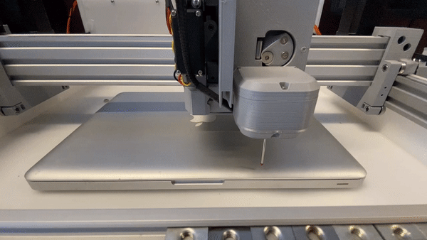
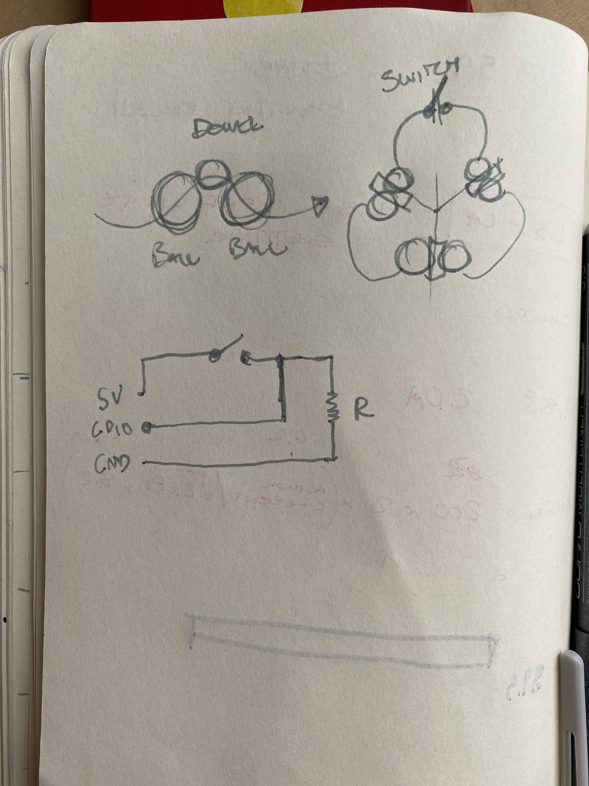
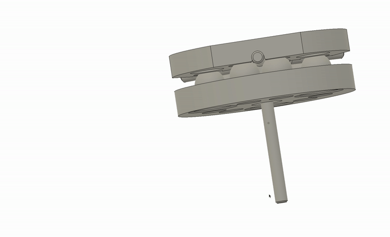

# Fab Touchprobe 
*By Frikk H Fossdal, May 2022*

## What is it

A fabrication friendly design of a 3-DOF touch probe. At the heart of the design is a circuit board that lights up on probe contact. 

## How to use it

The probe acts as a digital switch. Connect it to your favorite machine controller and start probing. 

## How to make it

The repo contains all the files that are necassary to print the parts and make the circuit. There are currently two circuit designs: one that is pcb mill friendly and one that is meant for fabrication houses. I'm using the latter. 

<iframe src="https://myhub.autodesk360.com/ue29e30e9/shares/public/SH9285eQTcf875d3c539d67aaeaef3a23b4d?mode=embed" width="800" height="600" allowfullscreen="true" webkitallowfullscreen="true" mozallowfullscreen="true"  frameborder="0"></iframe>

# Log

## 2203_2022 

Starting logging quite late in the process. I'll add documentation of what I actually have done later but right now I'm focusing on debugging. I have a circuit and its not working. I'm suspecting that there is something wrong in the design around the NPN transistor. FOUND IT! The footprint of the transistor is flipped in terms of the transistor I actually bought. I hacked a quick solution by soldering the transistors to the circuit on their heads. What did we learn here: never blindly trust footprints that you find online and ALWAYS READ THE DATASHEET of the parts you are using. 

I'll hopefully come back later this week and test the circuit on the duet. 

## Old log stuff - delete? 

Here is a gif of the kinematic coupling priciple. The top-side is held in place by the magnets. If the probe touches something, the kinematic coupling will loose contact with one of the ball-couplings and break the circuit. 

