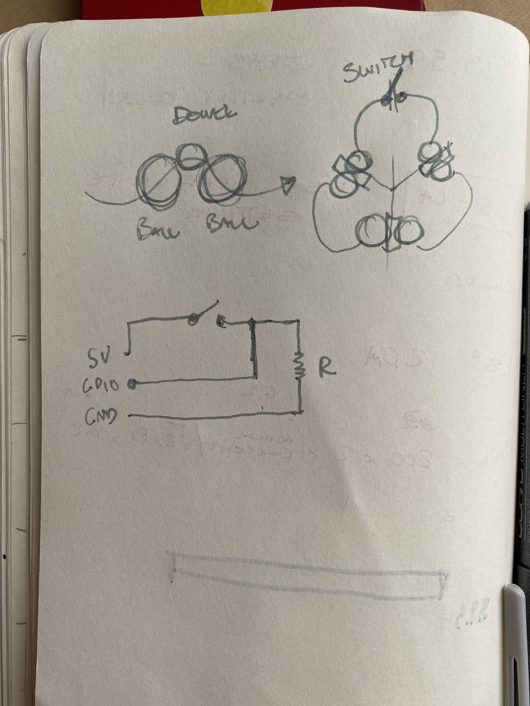
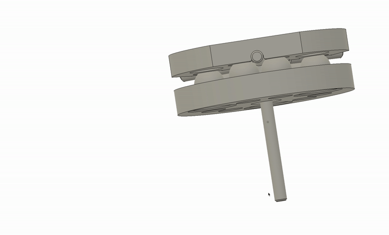

# Fab Touchprobe 

Documenting sparsely. Main goal of this project is to make a fabricatable touch probe that I can use to probe stuff on my clank. The philosophy driving the design lies in it's circuitry. I have a circular pattern of steel balls serving as contact points for 3 dowels. The circuit breaks if one of the dowels looses contact with the steel-ball-circuit. Rough sketch below. 

Here is a gif of the kinematic coupling priciple. The top-side is held in place by the magnets. If the probe touches something, the kinematic coupling will loose contact with one of the ball-couplings and break the circuit. 

## 22.03.2022 

Starting logging quite late in the process. I'll add documentation of what I actually have done later but right now I'm focusing on debugging. I have a circuit and its not working. I'm suspecting that there is something wrong in the design around the NPN transistor. FOUND IT! The footprint of the transistor is flipped in terms of the transistor I actually bought. I hacked a quick solution by soldering the transistors to the circuit on their heads. What did we learn here: never blindly trust footprints that you find online and ALWAYS READ THE DATASHEET of the parts you are using. 

I'll hopefully come back later this week and test the circuit on the duet. 

